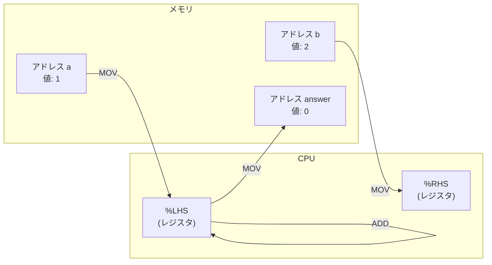

```mermaid
flowchart LR
    subgraph メモリ
        MEM_A["アドレス a<br>値: 1"]
        MEM_B["アドレス b<br>値: 2"]
        MEM_ANSWER["アドレス answer<br>値: 0"]
    end

    subgraph CPU
        REG_LHS["%LHS<br>(レジスタ)"]
        REG_RHS["%RHS<br>(レジスタ)"]
    end

    MEM_A -->|MOV| REG_LHS
    MEM_B -->|MOV| REG_RHS
    REG_LHS -->|ADD| REG_LHS
    REG_LHS -->|MOV| MEM_ANSWER


```
